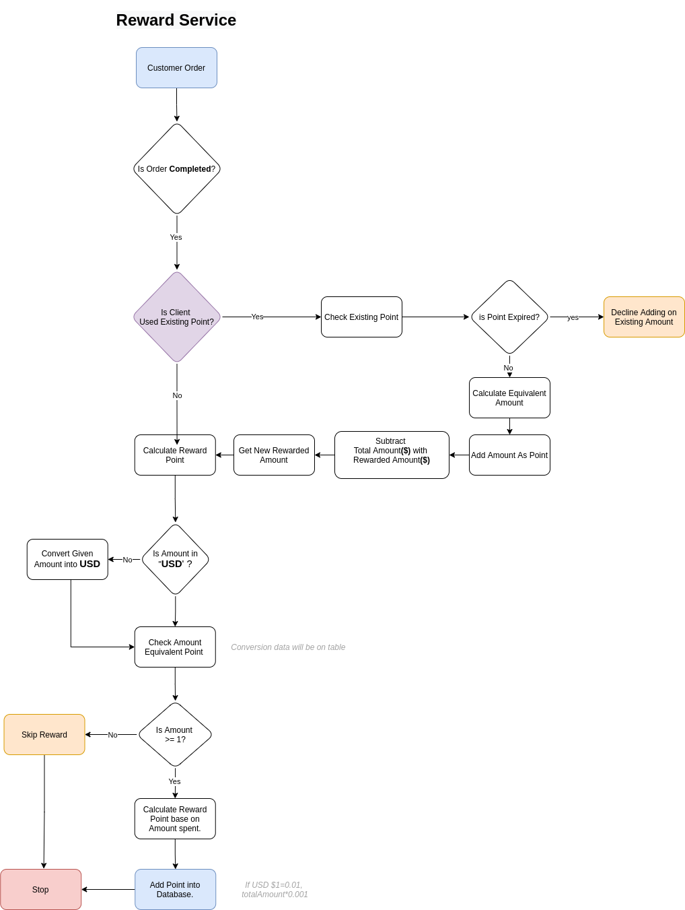

# Reward System Prototype System

## Currenlty Supported Currencies Are:
1. USD DOLLAR(usd_dollar)
1. Australian DOLLAR(aus_dollar)

## Available Classes
All application classes are wrapped in single container with auto registration via **registration.php** file.

If you want to include **Reward** class, you dont have to require all classes, just add **registration.php** on your bootstraping PHP file. eg **index.php** or **app.php**


### **Reward Class**
    Class that automatically handle default method, auto request method to either get **point** or **Equivalent Point Value in Dollar**

### **Reward Conversion Class**
    It is main class that convert any currencies into USD dollar and overrides **amount** and **point** on the basis of user input

### Traits
    I tried to use traits to manage certain configuration.
    Currently i am not using database to fetch and get information so that i used that method.


## Usages

### Get Dollar Point 
```php

use Container\Repository\Reward;
$rewardClass = new Reward(10);
echo 'Reward point for dollar: ', $rewardClass->get('point');

```

### Get Dollar Point Amount Value
```php

use Container\Repository\Reward;
$rewardClass = new Reward(10);
echo 'Reward point eqivalent amount for dollar: ', $rewardClass->get('value').PHP_EOL;

```

<i>Note: **Reward** constructor is auto set to USD DOLLAR, so we dont need to inject it for USD currency</i>


### Other Currencies 
```php

$rewardClass = new Reward(10,'Aus_dollar');
echo 'Reward point for Aus_dollar: ', $rewardClass->get('point').PHP_EOL;
echo 'Reward point eqivalent amount for Aus_dollar: ', $rewardClass->get('value');

```

### Application Diagram


